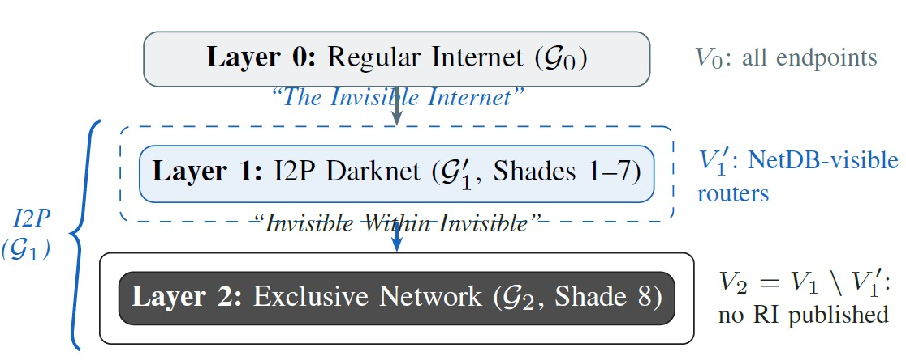
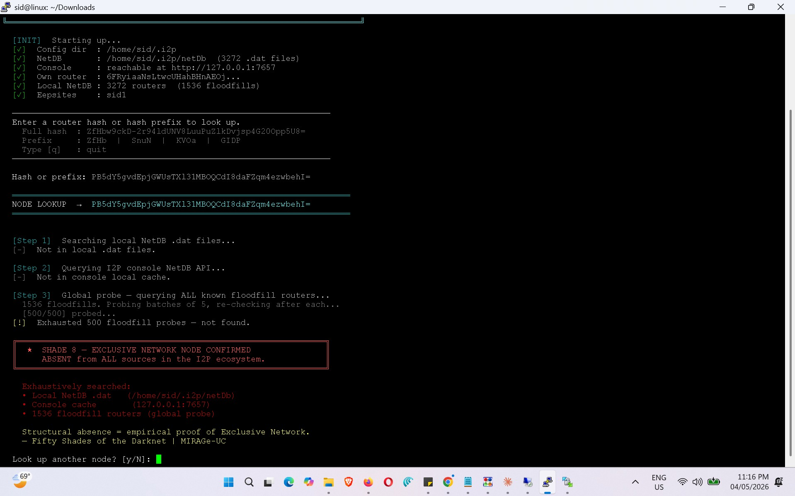
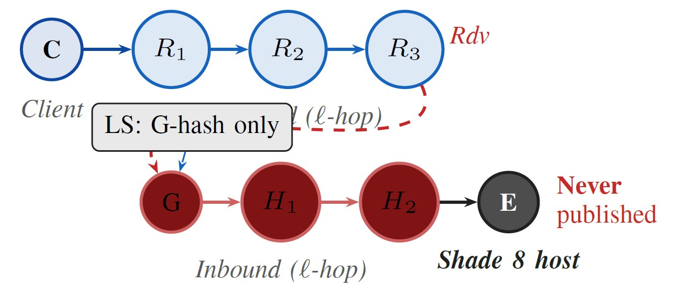
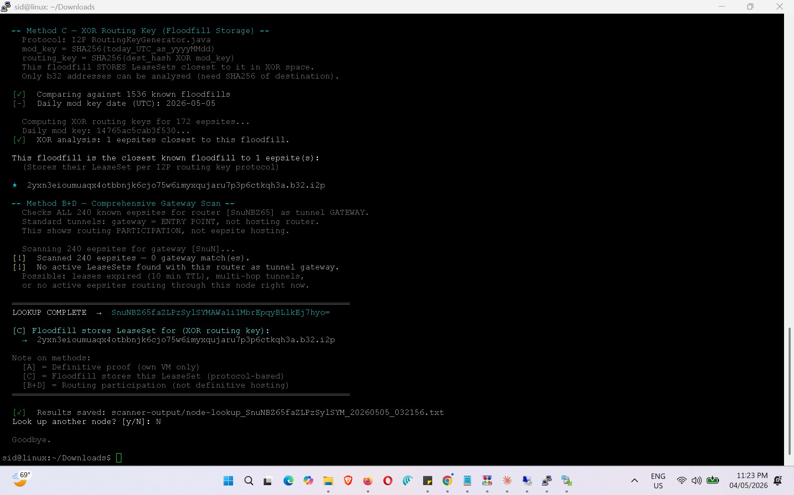

# Fifty Shades of Darknet

<p align="center">
  
</p>

<p align="center">
  <b>Empirical demonstration of the Exclusive Network: a structurally distinct, directory-invisible sublayer within I2P</b>
</p>

<p align="center">
  <a href="https://github.com/abksiddique/FiftyShadesDarknet/blob/main/LICENSE">
    
  </a>
  <a href="https://www.ieee.org/conferences/milcom">
    
  </a>
  <a href="https://github.com/abksiddique/FiftyShadesDarknet">
    
  </a>
  <a href="mailto:muntaksr@mail.uc.edu">
    
  </a>
</p>

---

## Overview

This repository contains all configuration scripts, lookup tools, and supporting materials for the paper:

> **Fifty Shades of Darknet**
> Siddique Abubakr Muntaka, Jacques Bou Abdo
> *MIRAGe-UC Lab, School of Information Technology, University of Cincinnati*
> IEEE MILCOM 2026 — Track 3: Cyber Security and Trusted Computing

The paper introduces and empirically validates the **Exclusive Network**: a structurally distinct sublayer within I2P whose nodes consume routing resources, host operational eepsites, and participate in garlic-encrypted traffic — while publishing **zero RouterInfo records** to the network's distributed database (NetDB). No existing empirical mapping technique can detect or characterise this sublayer. This repository provides the tools that prove it.

---

## The Core Finding

<p align="center">
  
</p>

> After **500 sequential floodfill probes** from a pool of **1,556 floodfill routers**, applied through **five attribution methods**, router H₁ produced **zero NetDB hits** while its hosted eepsite remained continuously accessible to authorised peers. This is the empirical proof of the Exclusive Network.

---

## What is the Exclusive Network?

Standard I2P measurement research assumes that probing the NetDB — the Kademlia-derived distributed hash table that stores RouterInfo (RI) records — characterises the network. This is wrong.

The NetDB is populated entirely by **voluntary publication**. A router may:

- Join the I2P network
- Build outbound tunnels as a client
- Host operational hidden services (eepsites)
- Route garlic-encrypted traffic through I2P infrastructure

…while publishing **no RouterInfo record** to any floodfill. It is a **free rider**: present in the true network, wholly absent from any observable directory. Two decades of empirical I2P measurement research have not characterised this sublayer.

We formalise this as:

```
V₂ = V₁ \ V₁'
```

Where:
- **V₁** = all active I2P router endpoints (true network)
- **V₁'** = routers that publish RouterInfo to the NetDB (observable network)
- **V₂** = the Exclusive Network (structurally absent from every directory)

The bound **ξ = 1 − ρ** (where ρ = |V₁'| / |V₁|) quantifies the inaccessible fraction. It is a hard protocol-design limit — not a calibration problem.

---

## The Shade Taxonomy

The paper introduces an eight-class visibility taxonomy derived entirely from observable RouterInfo fields. Shades 1–7 reside in Layer 1 (observable I2P); Shade 8 defines Layer 2 (the Exclusive Network).

| Shade | Name | Criteria | C2 Role | Layer |
|-------|------|----------|---------|-------|
| 1 | Beacon | κ_f, α=1 | NetDB anchor | 1 |
| 2 | Relay | High-cap, α=1 | Traffic relay | 1 |
| 3 | Passive | Low-cap, α=1 | BW donor | 1 |
| 4 | Cloaked | κ_U, α=1 | Hidden relay | 1 |
| 5 | Veiled | α=0, ι=1 | Covert relay | 1 |
| 6 | Declared | κ_H, α=0 | Semi-hidden | 1 |
| 7 | Phantom | α=0, ι=0, δ=1 | Ghost node | 1 |
| **8** | **Exclusive** | **δ=0** | **Stealth C2** | **2** |

Where: κ_f = floodfill flag, κ_H = hidden flag, κ_U = firewalled flag, α = address published, ι = introducer present, δ = RouterInfo in NetDB.

**Shade 7** is hard to reach. **Shade 8** is structurally absent from the NetDB — a categorically different condition.

---

## I2P Tunnel Architecture and the LeaseSet

<p align="center">
  
</p>

The LeaseSet publishes only the **gateway hash G** — the entry point of the inbound tunnel. The Shade 8 hosting endpoint **E** is absent from both the LeaseSet and the NetDB. An adversary who obtains the LeaseSet learns only the gateway, never the host.

---

## Three-Node Testbed

The empirical validation used three Ubuntu 24.04 LTS nodes running I2P 2.12.0 (API 0.9.69):

| Node | Role | Router Hash | Script |
|------|------|-------------|--------|
| **VM1** | Exclusive Host | `PB5dY5gvdEpj...` | `exclusiveStealth-network.sh` |
| **VM2** | Authorised Partner | `6FRyiaaN...` | `setup-i2p-proxy.sh` |
| **VM3** | Adversary Scanner | — | `node-lookup.py`, `b32-lookup.py` |

VM3 simulates an adversary approaching from **two directions simultaneously**:
- Knowing the **router hash** but not the b32 eepsite address
- Knowing the **b32 address** but not the hosting router hash

Both approaches return zero attribution results for a Shade 8 node.

---

## Five Attribution Methods

The attribution framework applies five techniques against the target:

| Method | Approach | Applied By |
|--------|----------|------------|
| **A** | b32 Derivation from `eepPriv.dat` | VM1 (control) |
| **B** | Gateway Scan — LeaseSet inspection | VM3 (adversarial) |
| **C** | XOR Routing Key — floodfill association | VM3 (adversarial) |
| **D** | Direct NetDB lookup | VM3 (adversarial) |
| **Console** | I2P console NetDB API query | VM3 (adversarial) |

All five methods return **zero hits** for a Shade 8 node.

---

## Method C: XOR Routing Key Analysis

<p align="center">
  
</p>

Method C computes the XOR routing key for each known b32 address and identifies the nearest floodfill storage node. For observable Layer 1 routers, this method successfully associates eepsites with their responsible floodfill. For a Shade 8 node, there is no LeaseSet in the NetDB to associate — the method confirms structural absence.

---

## Repository Structure

```
FiftyShadesDarknet/
├── I2PRouterScripts/
│   ├── exclusiveStealth-network.sh     # Ghost/Exclusive profile deployment
│   ├── customtld-manager.sh            # Custom TLD routing for eepsites
│   ├── setup-i2p-proxy.sh              # Authorised partner SOCKS5 config
│   ├── node-lookup.py                  # Five-method Shade classifier
│   ├── b32-lookup.py                   # b32-to-router attribution probe
│   ├── InvisibleInternet.jpg           # Three-layer hierarchy figure
│   ├── Leaseset.jpg                    # I2P tunnel architecture figure
│   ├── nodelookup-exclusivedetected-second_one.jpg
│   └── nodelookup-Noexclusivedetected2-ii.jpg
└── README.md
```

---

## Scripts

### `exclusiveStealth-network.sh`
Deploys the Exclusive Network (ghost) profile on an I2P router. Applies 10 core parameters (Exclusive profile) plus 8+ additional parameters (Ghost profile) suppressing all directory participation, disabling peer testing, enabling ephemeral identity rotation, and configuring introducer-only reachability.

**Core parameters applied:**
```bash
router.isHidden=true
router.hiddenMode=true
i2np.udp.addressSources=          # empty
i2np.ntcp2.autoip=false
router.floodfillParticipant=false
router.maxParticipatingTunnels=0
router.sharePercentage=0
router.enablePeerTest=false
router.dynamicKeys=true            # ephemeral identity
i2np.udp.requireIntroductions=true
```

### `node-lookup.py`
The primary Shade classification tool. Given a router hash, executes all five attribution methods in sequence:
1. Local NetDB `.dat` file inspection
2. I2P console API cache query (`127.0.0.1:7657/netdb`)
3. Floodfill probe expansion (batches of 5, re-check after each)
4. Gateway scan across all known LeaseSets
5. XOR routing key association (Method C)

Returns the Shade class (1–8) with full evidence trail.

### `b32-lookup.py`
Adversarial probe approaching from the eepsite direction. Given a b32 address, attempts to identify the hosting router through LeaseSet inspection and XOR proximity analysis. Confirms that for Shade 8 nodes, b32 knowledge alone is insufficient for router attribution.

### `customtld-manager.sh`
Manages custom TLD routing for eepsites (e.g., `sid001.i2p`) within the Exclusive Network testbed. Configures the naming resolution chain without exposing the hosting router to directory-based discovery.

### `setup-i2p-proxy.sh`
Configures the authorised partner (VM2) with SOCKS5 access to the Exclusive Network eepsite via an out-of-band b32 address. Demonstrates that operational accessibility is preserved despite structural NetDB invisibility.

---

## Threat Model Context

The Exclusive Network is directly exploitable for persistent covert C2 operations. Two documented threat patterns share its structural property:

**I2PRAT (RATatouille)** — Documented I2P-based remote access trojan (Sekoia, Feb. 2025). Implants connect via the SAM bridge (port 7656) to a C2 eepsite hardcoded in the malware binary. When the C2 server is configured as Shade 8, outgoing traffic from compromised hosts is indistinguishable from legitimate I2P participation.

**ORB Networks** — Nation-state Operational Relay Box infrastructure (Mandiant, May 2024) achieves comparable unattributability through jurisdictional dispersion of compromised relay infrastructure. Both instantiate the same mathematical property: G_dark ⊂ G — an operational subgraph contributing to network behaviour while absent from every observable directory.

---

## Empirical Results Summary

| Measurement | Value |
|-------------|-------|
| Total RI records in snapshot | 3,242 |
| Floodfill routers in pool | 1,556 (48.0%) |
| Floodfill probes applied to H₁ | 500 |
| NetDB hits for H₁ (Shade 8) | **0** |
| Attribution methods applied | 5 |
| Eepsite accessibility during probing | **Continuous** |
| Shade 1 (Beacon) found within | 72 probes |
| Shade 7 (Phantom) found within | 645 probes |
| Shade 8 (Exclusive) found within | **Never** |

---

## Citation

If you use this repository, please cite the paper and the dataset:

**Paper:**
```bibtex
@inproceedings{muntaka2026fiftyshades,
  author    = {Muntaka, Siddique Abubakr and Bou Abdo, Jacques},
  title     = {Fifty Shades of Darknet},
  booktitle = {Proceedings of IEEE Military Communications Conference (MILCOM)},
  year      = {2026},
  publisher = {IEEE},
  note      = {Track 3: Cyber Security and Trusted Computing},
  url       = {https://github.com/abksiddique/FiftyShadesDarknet}
}
```

**Related Dataset (SWARM-I2P):**
```bibtex
@dataset{muntaka2025mapping,
  author    = {Muntaka, Siddique A. and Bou Abdo, Jacques and Akanbi, Kemi
               and Oluwadare, Sunkanmi and Hussein, Faiza and Konyo, Oliver
               and Asante, Michael},
  title     = {Mapping the Invisible Internet: Framework and Dataset},
  year      = {2025},
  publisher = {Zenodo},
  doi       = {10.5281/zenodo.15369068},
  url       = {https://doi.org/10.5281/zenodo.15369068}
}
```

---

## Related Work

| Repository | Description |
|------------|-------------|
| [SWARM-I2P](https://github.com/abksiddique/swarmi2p) | Large-scale I2P deployment framework and SWARM-I2P dataset |
| [I2PEMM](https://github.com/abksiddique/I2PEMM) | Extended Mathematical Model of I2P's emergent topology |

---

## Authors

**Siddique Abubakr Muntaka** — PhD Candidate, MIRAGe-UC Lab, University of Cincinnati
`muntaksr@mail.uc.edu`

**Jacques Bou Abdo** — Principal Investigator, MIRAGe-UC Lab, University of Cincinnati
`bouabdjs@ucmail.uc.edu`

**MIRAGe-UC** — Multi-domain and Information Operations, Resilience and Anonymity Groupe
School of Information Technology, University of Cincinnati, OH 45221, USA | mirage-uc.org

---

## License

Code: MIT License — see [LICENSE](LICENSE)
Research figures and paper content: All rights reserved, University of Cincinnati MIRAGe-UC Lab

---

<p align="center">
  <i>Invisible Within Invisible — the Exclusive Network exists. This repository proves it.</i>
</p>
